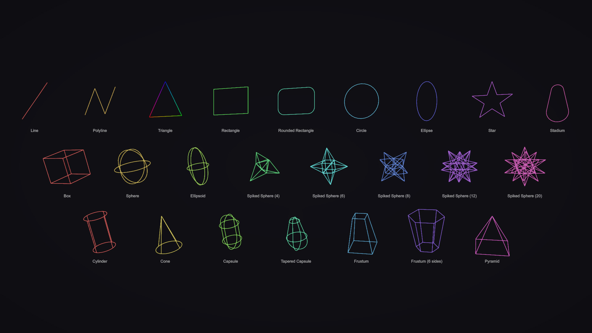
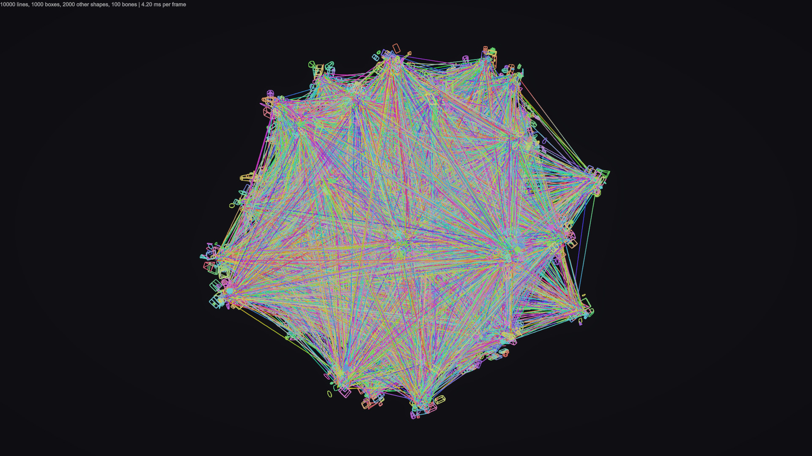

# Wireframes for Unity

Wireframe shapes for Unity 6 that follow Transforms at no per-frame CPU cost to your code.



You create a shape once, attach it to any Transforms ("bones"), and it moves with them from then on. The GPU does the moving, through the same skinning Unity uses for animated characters. Every shape in a container is one mesh, drawn in one draw call.



## Why not `Debug.DrawLine`?

| | `Debug.DrawLine` / Gizmos | Wireframes |
|---|---|---|
| Moving shapes | Call it again every frame, for every line | Create once; bones move them on the GPU |
| CPU cost per frame | Grows with the number of lines | No work from the package while nothing is edited |
| Player builds | Not drawn | Drawn |

## Requirements

- Unity 6 (6000.0) or later.
- The default material is an unlit vertex-color shader, written for and tested with the Built-in Render Pipeline. With URP or HDRP, if it doesn't render, pass your own material to the container; any shader that outputs vertex colors works.

## Installation

In **Window > Package Manager**, choose **+ > Install package from git URL** and enter:

```
https://github.com/reromanlee/Wireframes.git?path=/UnityPackage
```

Or add it to `Packages/manifest.json`:

```json
"com.reromanlee.wireframes": "https://github.com/reromanlee/Wireframes.git?path=/UnityPackage"
```

The package lives in the repository's `UnityPackage` folder, which the `path` parameter points to.

## Quick start

```csharp
using reromanlee.Wireframes;
using UnityEngine;

public class TargetingLine : MonoBehaviour
{
    [SerializeField] private Transform _hand;
    [SerializeField] private Transform _target;

    private LineContainer _wireframes;

    private void Start()
    {
        _wireframes = new LineContainer();

        // A line from the hand to the target that follows both.
        _wireframes.CreateLine(_hand, _target).SetColor(Color.cyan);

        // A box around the target that moves, rotates and scales with it.
        _wireframes.CreateBox(_target, new Vector3(-0.5f, -0.5f, -0.5f), new Vector3(0.5f, 0.5f, 0.5f));

        // A circle of radius 1 lying flat around the target.
        _wireframes.CreateCircle(_target, Vector3.zero, 1f).SetColor(Color.yellow);
    }

    private void OnDestroy()
    {
        _wireframes.Dispose();
    }
}
```

There is no `Update`: every shape follows `_hand` and `_target` on its own.

## Shapes

| Shape | Usual Create method | What it is |
|---|---|---|
| `ILine` | `CreateLine(a, b)` | A segment; each end has its own bone. |
| `IPolyline` | `CreatePolyline(points)`, `CreatePolygon(points)`, `CreateTriangle(a, b, c)` | Points joined in order, open or closed; each point has its own bone and color. |
| `IBox` | `CreateBox(cornerA, cornerB)` | A box with a center, a rotation and a `Size`. |
| `IRectangle` | `CreateRectangle(cornerA, cornerB)` | A flat rectangle. |
| `IRoundedRectangle` | `CreateRoundedRectangle(cornerA, cornerB, cornerRadius)` | A flat rectangle with round corners. |
| `ICircle` | `CreateCircle(center, radius)` | A flat circle; `CreateCircle(center, normal, radius)` faces a direction. |
| `IEllipse` | `CreateEllipse(tipA, tipB, radius)` | A flat ellipse whose long axis runs between two tips. |
| `IStar` | `CreateStar(center, innerRadius, outerRadius, points)` | A flat star. |
| `ISphere` | `CreateSphere(center, radius)` | Three great circles. |
| `IEllipsoid` | `CreateEllipsoid(tipA, tipB, radius)` | Three ellipses, with a radius along each axis. |
| `ISpikedSphere` | `CreateSpikedSphere(center, baseRadius, spikeLength, spikeCount)` | A 3D star: a Platonic solid with a spike on each face, so 4, 6, 8, 12 or 20 spikes. |
| `ICylinder` | `CreateCylinder(endA, endB, radius)` | Two rings joined by four lines. |
| `ICone` | `CreateCone(tip, baseCenter, radius)` | A base ring joined to the tip by four lines. |
| `ICapsule` | `CreateCapsule(centerA, centerB, radius)` | Two spheres wrapped together, like `Physics.CapsuleCast`; each end can have its own radius. |
| `IStadium` | `CreateStadium(centerA, centerB, radius)` | The flat outline of a capsule. |
| `IFrustum` | `CreateFrustum(endA, endB, radiusA, radiusB, sides)` | Two regular polygons joined at every corner. Prisms and regular pyramids are frustums too. |
| `IPyramid` | `CreatePyramid(tip, baseCenter, baseSize)` | A rectangular base joined to a tip, like a camera's view without its near plane. |

## Concepts

### Container

`new LineContainer()` creates a GameObject named **Wireframes** in the active scene, with one skinned mesh for all of its shapes.

- It lives until you call `Dispose()` or its scene unloads. Either way, every shape it created is disposed too, and `IsDisposed` becomes true.
- `new LineContainer(material)` draws with your material instead. The container never destroys a material you pass in.
- Create containers and shapes on the main thread, from `Awake`, `Start` or later, not from constructors or field initializers.

### Bones and spaces

A **bone** is any Transform a shape follows. `null` means world space.

- Lines and polylines have a bone for every point, because points can go anywhere and still make a line.
- Every other shape has one bone and moves rigidly with it, like a child Transform (`IRigidShape`). It has a position and a rotation relative to that bone, and its sizes are in the bone's units, so it also scales with the bone.
- `Local*` properties are relative to the bone. Without a bone they are world space.
- `World*` properties convert through the bone's current pose, like `Transform.position`.
- Changing a bone keeps the shape where it is in the world, like reparenting a Transform: points keep their world position, and other shapes also keep their world rotation and size. From then on it moves with the new bone.

**Rule of thumb: create a shape on its bone when you know the bone, or set the bone first and then the position in whichever space you mean.**

| You want | Write |
|---|---|
| A line joining two transforms | `CreateLine(a, b)` |
| A point at an offset from a bone, e.g. a sword tip | `line.BoneB = sword; line.LocalPositionB = new Vector3(0f, 1f, 0f);` |
| A point pinned where something was hit, moving with it | `line.BoneA = hitTransform; line.WorldPositionA = hit.point;` |
| A shape that stops following | `shape.Bone = null;` (it stays where it is) |

### Create methods

Every shape except lines and polylines has the same kinds of Create methods:

| Kind | Example | Space |
|---|---|---|
| No arguments | `CreateCylinder()` | A white shape of unit size at the world origin: radius 0.5, sizes 1, length 1. |
| The usual form | `CreateCylinder(endA, endB, radius)` | World space. |
| The same with a bone first | `CreateCylinder(bone, localEndA, localEndB, radius)` | The bone's local space. |
| Position and rotation | `CreateCylinder(position, rotation, length, radius)` | World space. |

A few shapes add an obvious extra, such as `CreateCircle(center, normal, radius)` or a stadium with an explicit normal.

Lines and polylines are made of points: they are created from world positions, or from one bone per point, each point sitting at its bone's origin. `CreateLine()` starts with both ends at the world origin.

### A shape's axes

A shape's rotation turns its own axes:

- **+Y is the normal of flat shapes.** Rectangles, circles, ellipses, stars and stadiums lie in their XZ plane, so with no rotation they lie flat on the ground, or flat around their bone.
- **+Z is the axis of long shapes** (`IAxialShape`: cylinders, cones, capsules, stadiums, frustums and pyramids). They start at end A, at their position, and run `Length` along +Z to end B. Setting `LocalEnd` or `WorldEnd` moves end B: the axis turns by the smallest rotation and `Length` follows.
- Other shapes are centered on their position.
- `Quaternion.LookRotation(axis, normal)` is the rotation that points a shape's +Z along `axis` with +Y toward `normal`.
- A shape created from two points turns so that its +Y stays as close to world up, or its bone's up, as it can. A stadium or ellipse created that way lies as flat as it can.
- Capsule and stadium ends are the centers of their spheres or circles, as in `Physics.CapsuleCast`. When one sphere holds the other, only the bigger one is drawn.

### Sizes and resolution

- Sizes are in the bone's units. Changing a shape's bone multiplies them by the ratio of the two bones' scales, so the shape keeps its size in the world. That is exact for uniformly scaled bones.
- Sizes are used as given: a negative size mirrors the shape, and zero collapses it. A box keeps a signed `Size`, so both of its corners come back exactly as they were set.
- Round shapes take `segments`, the number of straight pieces a full circle is drawn with: 32 by default, at least 3. Arcs use their share: capsule caps and stadium ends get half, rounded rectangle corners a quarter. Cylinders, cones, capsules, stadiums and rounded rectangles need a multiple of 4, because their lines meet their rings at quarter points.
- Round shapes are drawn like Unity's gizmos, with rings and a few lines: a sphere is three circles and a cylinder is two rings joined by four lines. Shapes with corners draw every edge.
- The number of segments, sides, star points and spikes, and the number of points of a polyline, are fixed when a shape is created. To change them, create a new shape.

### Colors

- Lines and polylines have a color per point, blended along the edges. `SetColor` sets them all.
- Every other shape has one `Color`. `SetColor` sets it too.
- Colors are stored with 8 bits per channel, so values above 1 are clamped: no HDR glow.
- In linear color space (the Unity 6 default), the default shader converts vertex colors so they look the same as that `Color` on a material.
- The default material is opaque, so alpha has no effect.

### When edits show up

Setters only record the change. Each edited shape is queued once per frame, however many properties you set. The queue is uploaded at the end of `LateUpdate`, after scripts with the default execution order and before Unity renders, so edits appear in the same frame. Edits made later in the frame, such as in `WaitForEndOfFrame` or camera callbacks, appear in the next one.

### Destroyed bones

When a bone's GameObject is destroyed, the shapes and points attached to it stay exactly where they were, at the same size, and switch to world space: their bone becomes `null`. The shapes themselves stay alive.

This works through a small hidden component that the package adds to every GameObject used as a bone and removes when no shape uses it anymore. If a bone's GameObject is destroyed without ever having been active, Unity doesn't notify that component. The package still notices, but the bone's last pose is lost, so its shapes use their local values as world ones and a warning is logged.

### Disposing shapes

`shape.Dispose()` removes a shape and frees its space for the next shape with the same number of vertices. After that, `IsDisposed` is true and every other member throws `ObjectDisposedException`.

## Wireframe camera

Add the **WireframeCamera** component to a Camera to draw everything that camera renders as wireframe, like the Scene view's Wireframe draw mode, while other cameras draw normally.

- It works under the Built-in Render Pipeline and any Scriptable Render Pipeline (URP, HDRP or custom), and follows the pipeline if it changes at runtime. The frame in which the pipeline switches is drawn without wireframe.
- It uses `GL.wireframe`, so the graphics API must support wireframe rendering; OpenGL ES and WebGL don't.
- The package's own shapes are lines already, so they look the same through it.

## Performance

- **One mesh, one draw call and one skinned renderer per container**, however many shapes and shape types it holds.
- **Moving bones costs the package nothing.** Unity computes one matrix per bone and skins the vertices on the GPU.
- **Edits cost only what changed.** Each edited shape is written once per frame, and only the changed parts of the GPU buffers are uploaded. Editing a shape rewrites all of its vertices, so a big sphere costs more to edit than a line.
- **Adding and removing shapes is cheap on average.** Buffers double in size when full and never shrink. Freed space is reused by the next shape with the same number of vertices, and it is packed away once it fills half the buffer.
- **Memory:** 20 bytes per vertex on the GPU (position, color, bone index), plus a CPU copy, and 2 indices per edge. Indices start 16-bit and switch to 32-bit automatically once the vertex buffer outgrows them.

| Shape, with the default resolution | Vertices | Edges |
|---|---|---|
| Line | 2 | 1 |
| Polyline of n points | n | n - 1, or n when closed |
| Box | 8 | 12 |
| Rectangle | 4 | 4 |
| Rounded rectangle | 36 | 36 |
| Circle, ellipse | 32 | 32 |
| Star with 5 points | 10 | 10 |
| Sphere, ellipsoid | 96 | 96 |
| Spiked sphere with 4, 6 or 8 spikes | 8, 14 or 14 | 18, 36 or 36 |
| Spiked sphere with 12 or 20 spikes | 32 | 90 |
| Cylinder | 64 | 68 |
| Cone | 33 | 36 |
| Capsule | 122 | 132 |
| Stadium | 34 | 34 |
| Frustum with n sides | 2n | 3n |
| Pyramid | 5 | 8 |

Measured by the package's performance tests in the Editor on a desktop PC (Unity 6000.5, Direct3D 12), on 100 bones:

| Operation | 10,000 lines | 1,000 spheres (96,000 vertices) |
|---|---|---|
| Create the shapes on their bones | 4.6 ms | 3.4 ms |
| First upload | 1.9 ms | 6.8 ms |
| A frame where nothing changed | 0.1 µs | 0.1 µs |
| A frame where all 100 bones moved | 2.3 µs | 0.2 µs |
| Scattered edits: 1,000 line colors, 100 sphere radii | 0.1 ms, plus 0.3 ms upload | 0.01 ms, plus 0.7 ms upload |
| Dispose half of the shapes | 0.4 ms, plus 0.6 ms upload | 1.4 ms, plus 6.4 ms upload |

Two things to keep in mind:

- **GPU skinning must be on.** If a project disables it in Player Settings, or the platform has no compute shaders (for example WebGL), Unity skins on the CPU every frame, at a cost that grows with the vertex count.
- **Shapes are never frustum-culled.** Shapes follow arbitrary Transforms, so the mesh uses fixed bounds of ±1,000 km around the world origin instead of recomputing them every frame.

## Limitations

- Lines are always 1 pixel wide.
- The default material is opaque and depth-tested. For transparency or always-on-top lines, pass your own material.
- Main thread only. Shapes are drawn in Play mode and in builds, not in Edit mode.
- One bone per shape, except for lines and polylines, which have one per point.
- A shape's resolution and a polyline's number of points can't change after it is created.

## Samples

Import them from the package's **Samples** tab in the Package Manager.

**Shape Gallery** lays out every shape in three rows, each turning with its own bone. Open its **ShapeGallery** scene and enter Play mode: the camera frames the rows against a dim background.

**Stress Test** spawns 10,000 lines, 1,000 boxes and 2,000 other shapes on 100 orbiting bones. Add the `StressTest` component to an empty GameObject in a scene with a camera, and enter Play mode with the Profiler open. Raise **Recolor Per Frame** to measure the cost of edits.

## Tests

To run the package's tests in the Test Runner, add the package to `testables` in `Packages/manifest.json`:

```json
"testables": ["com.reromanlee.wireframes"]
```

## Roadmap

- Arrows, camera frustums and more shapes, all drawn by the same mesh.
- Text drawn with lines.
- Built-in transparent and always-on-top materials.

## License

[MIT](LICENSE.md)
