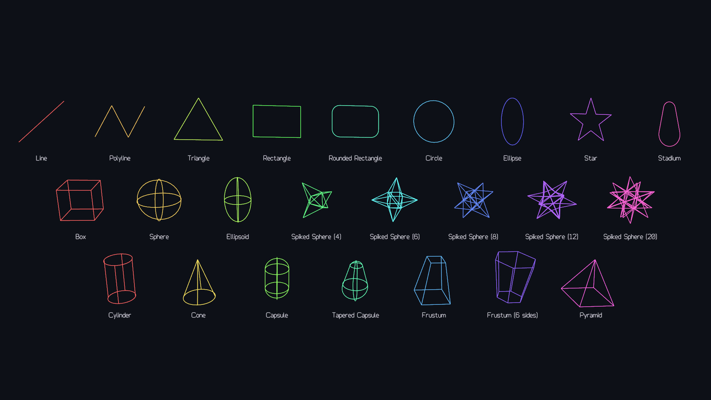
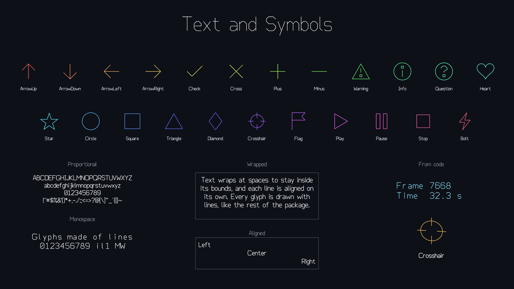
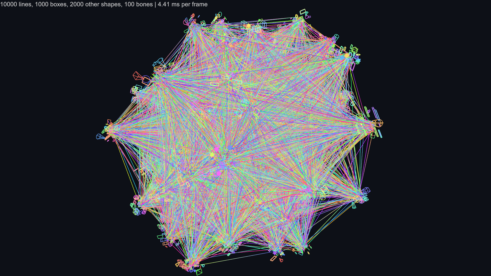
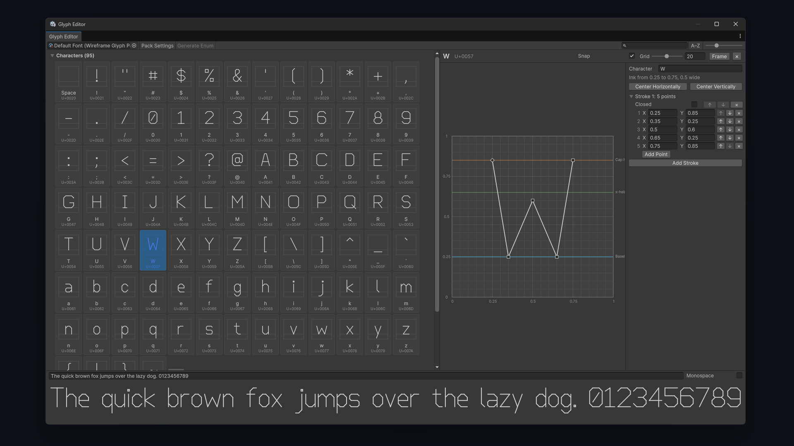
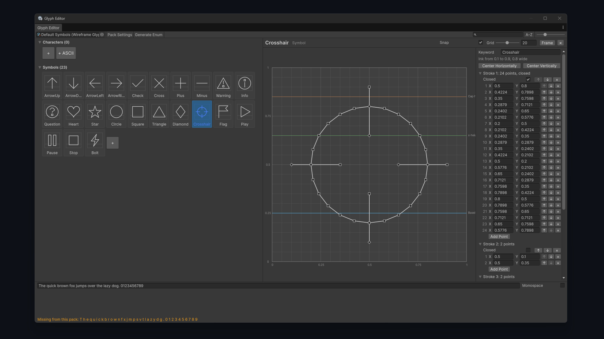

### About Wireframes

Wireframe shapes for Unity that follow Transforms on the GPU: create a shape once, and it moves with its bones.



Lines, polylines, boxes, circles, spheres, capsules, cones and more attach to any Transforms, called bones. The package uploads each bone's matrix once per frame and the vertex shader moves every vertex, so moving shapes cost your code nothing and an edit uploads only what it changed.



Text and symbols are drawn with lines too, in 2D or 3D, from glyph packs you can edit in the Glyph Editor: the package comes with a font of the printable ASCII characters and 23 symbols.

Without writing code, add a shape component to a GameObject: it draws there at once, in Edit Mode too, and shows every change to its fields as you make it.

Shapes draw the same in Play Mode, Edit Mode and player builds, under the Built-in Render Pipeline, URP and HDRP, from desktops and phones to WebGL, while server builds keep them working without drawing.

### Features

1. Shapes follow Transforms on the GPU.
2. 19 shapes, from lines to text and symbols.
3. Shape components, edited live in Edit Mode.
4. A Glyph Editor for fonts and symbols.
5. Edits upload only what they change.
6. Steady frames allocate nothing.
7. Built-in Render Pipeline, URP and HDRP.
8. Windows, Android, WebGL and more.
9. Play Mode, Edit Mode and builds.
10. Hidden lines hide, show or fade.
11. Shapes hide without being disposed.
12. Statistics and Profiler markers.
13. Destroyed bones leave shapes in place.
14. A camera that draws in wireframe.

Detailed about features - see [FEATURES.md](Documentation/FEATURES.md).

### Performance

**A frame where nothing changed costs about 25 µs** of CPU time for 10,000 lines on 100 bones, one where every bone moved about 0.1 ms, and one with 1,000 color edits about 0.3 ms, all without allocating. Each mesh of up to 65,535 vertices is one draw call, and a vertex takes 20 bytes on the GPU.



**The Stress Test sample, 13,000 shapes on 100 moving bones,** runs whole frames in 0.40 ms of main thread and 0.46 ms of GPU time on Windows (RTX 4070 Ti, Direct3D 12), 0.49 ms of main thread in a WebGL 2 build, and 4.24 ms of main thread and 5.64 ms of GPU time on Android (Poco X3 NFC, Vulkan).

Detailed about performance - see [PERFORMANCE.md](Documentation/PERFORMANCE.md).

### Requirements

1. Unity 2022.3 or later.
2. The Built-in Render Pipeline, URP or HDRP.
3. Shader model 3.5: Direct3D 11 or 12, Vulkan, Metal, OpenGL Core, OpenGL ES 3.0 or WebGL 2.

### Limitations

1. Lines are always 1 pixel wide.
2. Colors have 8 bits per channel, so no HDR.
3. A shape has one bone, or lines and polylines one per point.
4. Resolution and point counts are fixed at creation.
5. Rings take up to 1,024 segments.
6. Shapes are never frustum-culled.
7. Shapes are used from the main thread only.
8. Custom materials skin with the package's HLSL.
9. Text has no kerning, and the default font has ASCII only.

### How to install

**From the git URL:** in **Window > Package Manager**, choose **+ > Install package from git URL** and enter the URL below. Add `#2.1.0` to its end to stay on that version.

```
https://github.com/reromanlee/Wireframes.git?path=/UnityPackage
```

**From a tarball:** download the `.tgz` file of the [latest release](https://github.com/reromanlee/Wireframes/releases/latest), then in **Window > Package Manager** choose **+ > Install package from tarball** and pick it.

Upgrading from 1.x - see [MIGRATION.md](Documentation/MIGRATION.md).

### How to use

**Create a `WireframeContainer`, then create shapes in it on the bones they follow.** A shape keeps following its bones until you dispose it or its container, with nothing to call per frame. Disposing the container disposes its shapes, and so does unloading the scene it was created in.

```csharp
using reromanlee.Wireframes;
using UnityEngine;

public sealed class TargetingLine : MonoBehaviour
{
    [SerializeField] private Transform _hand;
    [SerializeField] private Transform _target;

    private WireframeContainer _wireframes;

    private void OnEnable()
    {
        _wireframes = new WireframeContainer();

        // A line from the hand to the target that follows both.
        _wireframes.CreateLine(_hand, _target).SetColor(Color.cyan);

        // A circle of radius 1 lying flat around the target, moving, turning and scaling with it.
        _wireframes.CreateCircle(_target, Vector3.zero, 1f).Color = Color.yellow;
    }

    private void OnDisable()
    {
        _wireframes.Dispose();
    }
}
```

**Settings choose how a container draws, and properties change a shape at any time.** Every edit shows up in the next render, however many properties change, and hiding a shape keeps it for later.

```csharp
_wireframes = new WireframeContainer(new WireframeContainerSettings { Occlusion = WireframeOcclusion.Fade });

ISphere sphere = _wireframes.CreateSphere(_target, Vector3.zero, 0.5f);
sphere.Radius = 2f;
sphere.IsVisible = false;
```

**Text and symbols are shapes too,** drawn with the package's Default Glyphs unless given glyph packs of your own. Changing a text with `SetText` allocates nothing, so it can show a value that changes every frame.

```csharp
IText label = _wireframes.CreateText(_target, new Vector3(0f, 1.5f, 0f), Quaternion.identity, "Target");
ISymbol marker = _wireframes.CreateSymbol(_target, new Vector3(0f, 2.5f, 0f), Quaternion.identity, DefaultSymbols.Warning);
```

**Or add a shape component to a GameObject, with no code at all.** **Add Component > Wireframes** has one for every shape, from **Line** to **Pyramid**, **Text** and **Symbol**. It draws on its GameObject right away, in Edit Mode, Play Mode and builds, follows it like a mesh, and shows each change to its fields in the next render; disabling it hides the shape.





**Draw glyphs of your own in the Glyph Editor,** in **Window > Wireframes > Glyph Editor**: a gallery of a pack's characters and symbols, and a canvas that edits their lines with exact coordinates.

Detailed about usage - see [USAGE.md](Documentation/USAGE.md).

### License

Made by Roman Likhadievski ([reromanlee.com](https://reromanlee.com)).

Licensed under MIT - see [LICENSE.md](LICENSE.md).
